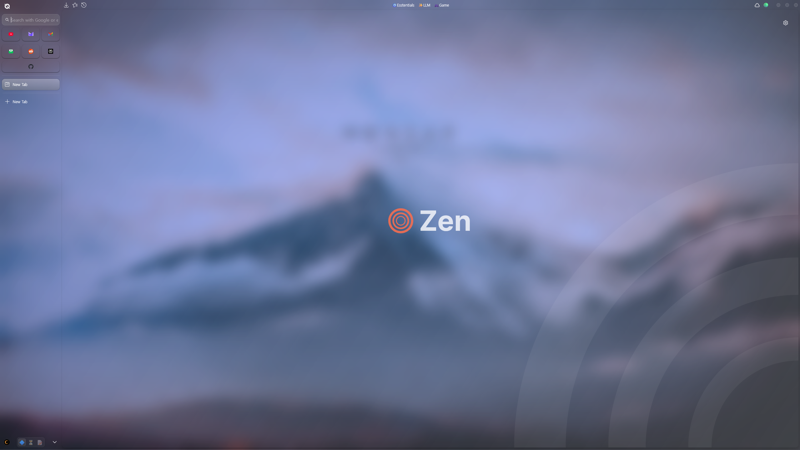
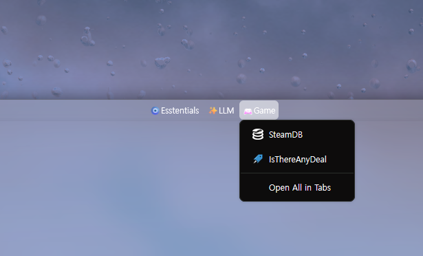
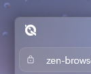
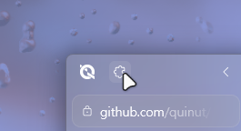
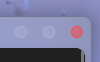
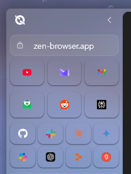

# KamirTweaks

*Used with [Natsumi Browser](https://github.com/greeeen-dev/natsumi-browser/tree/main), [Pineapple Fried](https://github.com/TheBigWazz/Pineapple-Fried), [DWMBlurGlass](https://github.com/Maplespe/DWMBlurGlass)*


Personal custom CSS for [Zen Browser](https://github.com/zen-browser).


# How to install
2. Extract and put KamirTweaks folder into \<profile\>/chrome folder
3. Add the following line  of code to userChrome.css
```css
@import "KamirTweaks/Kamir.css";
```

# What this tweaks contains

## Centered Bookmark


Inspired by/Used code of [n7itro's Bookmark Toolbar Tweaks](https://github.com/n7itro/Zen-Themes/tree/main/Bookmark%20Toolbar%20Tweaks)

## Changed Menu Icon


You can alter modules/img/menuIcon.png to change this.

## Show Unified Extensions Button only when hovered


## Traffic Light-Styled Control Box


Shows color when hovered

Yellow - Minimize
Green - Maximize
Red - Close

## Shadow only Essential/Pinned tab


It gives clean look... in my opinion?


<a href="https://zen-browser.app/">
  
</a>
